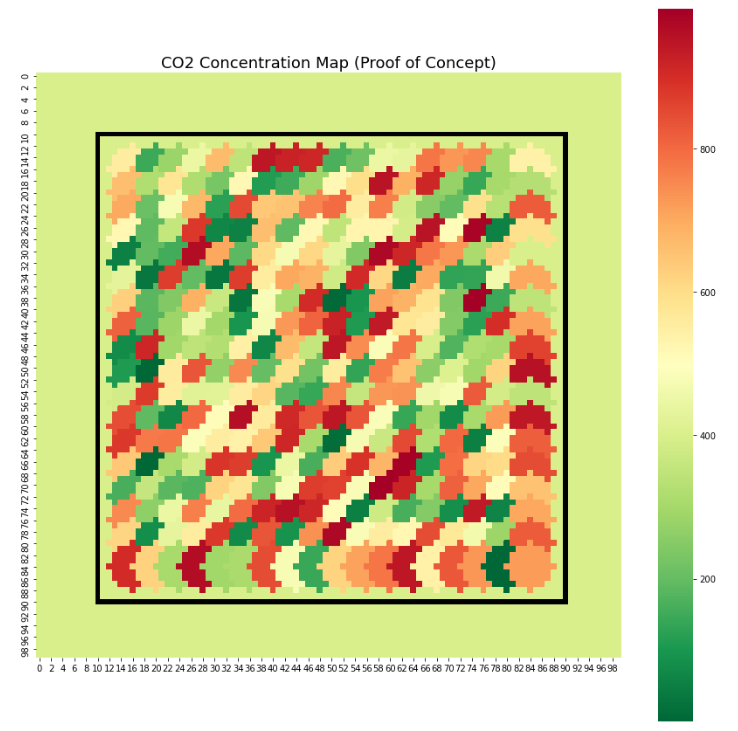
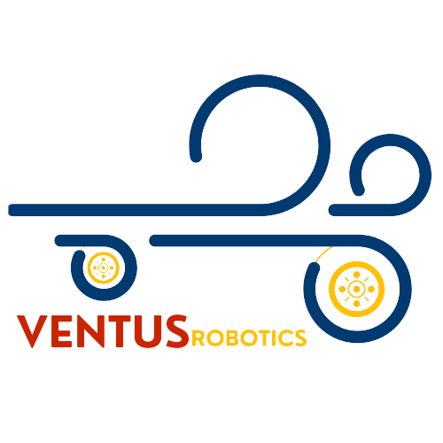

# ROS SLAM Heat Map

A ROS package which utilizes Simultaneous Localization and Mapping (SLAM) via Hector SLAM and carbon dioxide concentration data to generate real-time air-quality heat maps of indoor spaces. In the intended use-casek, an RPLiAR and an Adafruit SGP30 eCO2 sensor are mounted on a Lynxmotion Rover.

This package is used in concurrance with a joy-pad controller package in order to guide the rover around the room to collect data and make air-quality maps. 

## Proof of Concept
The following image shows a heat map for a square room with randomly generated CO2 concentration values. This was manually generated (i.e. did not use the ROS package) but shows proof of concept for this package.

## Ventus Robotics
Ventus Robotics is a (ficticious) leading environmental monitoring company.”Ventus”, Latin for ”wind”, conveys the company’s specialization
in monitoring air quality and illustrates the elegant yet dynamic nature of their robotic solutions.
Core competencies include:
- Design and iterative development of agile robotic solutions for condition monitoring using modern frameworks
- Integration of easy-access web-based responsive user interfaces which communicate with our systems
- Collection of requirements for complex consulting solutions
- Engineering communications and project documentation

