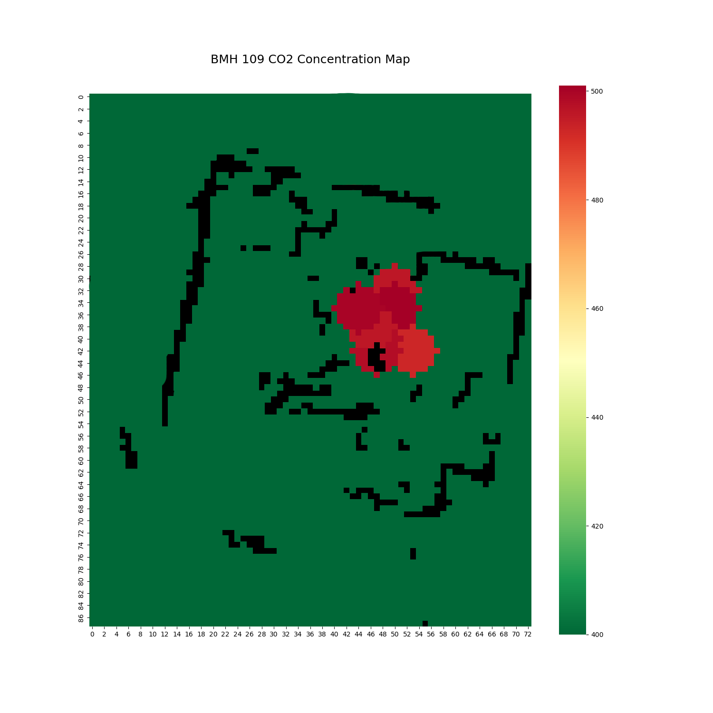

# ROS SLAM Heat Map

A ROS package which utilizes Simultaneous Localization and Mapping (SLAM) via Hector SLAM and carbon dioxide concentration data to generate real-time air-quality heat maps of indoor spaces. In the intended use-case, an RPLiAR and an Adafruit SGP30 eCO2 sensor are mounted on a Lynxmotion Rover.

This package is used in concurrance with a joy-pad controller package in order to guide the rover around the room to collect data and make air-quality maps.

### How it works, technically

_sgp30_read Node_

- Read current CO2 concentration from Adafruit SGP30 sensor
- Publish to CO2 PPM topic

_heat_map_generator Node_

- Create an empty matrix the same shape as the Occupancy Grid
- Get the origin of the robot and the conversion factor (resolution) to convert the robot's position in meters to a place within the occupancy grid matrix
- Update the current CO2 concentration map with the current - CO2 concentration at the present location.
- Publish localized CO2 concentration map

_"mask_generator" Node_

- Wait for an Occupancy Grid
- Resize Occupancy Grid tuple into 2D array
- Convert all values in matrix above 95 (i.e. where there is 95 percent certainty that this location is occupied) to true (i.e. mask shows at this location), rest false
- Publish matrix to Mask topic

_"heat_map_printer" Node_

- Create an empty matrix the same shape as the Occupancy Grid
- Get the origin of the robot and the conversion factor (resolution) to convert the robot's position in meters to a place within the occupancy grid matrix
- Update the current CO2 concentration map with the current CO2 concentration at the present location.
- Publish localized CO2 concentration map
- Save file as PNG
- Kill this node

### Improvements

The eCO2 sensor used (Adafruit SGP30) is incapable of reading carbon dioxide concentrations below 400 ppm; therefore, in a safe room, the matrix of localized carbon dioxide values will contain values of 400 only. Since all concentrations below 400 are considered safe, this is not a concern in practice, however, became of frustration when testing the rovers heat-mapping capability when in a safe space. This can be remedied by using the other CO2 sensor on board, the Adafruit SCD30, which despite having a lower overall accuracy (+/- 30 ppm compared to +/- 1 ppm on the SGP30) can detect concentrations below 400 ppm.
In future iterations, it would be convenient to allow the user to begin heat mapping and print a heat map by pressing buttons on the joy pad; currently, these operations must be done by launching the heat map package, and then running the print script, respectively, in the terminal.
For production, the uploading of heat maps to an external database should be automated. This maybe done using a script within the existing ROS package which posts the map, as well as metadata about the map such as the current date and time. This database should be accessed by the Ventus Robotics website so that users can view maps from their devices online.

## Sample Maps

### Heat Maps Generated Via Package

The following images show heat maps generated using this package.

_Figure 1: A map of my room displaying carbon dioxide concentration along the robot's path._

Notice in Figure 4, there is no variance in the conentration of CO2 in my home. This is due to a limitation of the CO2 sensor used, which can only detect CO2 concentrations above 400 ppm. My house was all below this level at the time this was taken. Glad to have good ventilation!

_Figure 4: A map of concentration throughout my house._(proofofconcept_concmap.png)

### Heat Maps Generated Via Simulation

The following maps were generated using a simulation to test the algorithm. CO2 PPM values were randomly generated; the room layout is a simple square to demonstrate masking functionality.

_Figure 3: A map of randomized CO2 concentrations without the application of a Gaussian Blur_

_Figure 4: A map of randomized CO2 concentrations WITH the application of a Gaussian Blur_

## Ventus Robotics

Ventus Robotics is a (ficticious) leading environmental monitoring company.”Ventus”, Latin for ”wind”, conveys the company’s specialization
in monitoring air quality and illustrates the elegant yet dynamic nature of their robotic solutions.
Core competencies include:

- Design and iterative development of agile robotic solutions for condition monitoring using modern frameworks
- Integration of easy-access web-based responsive user interfaces which communicate with our systems
- Collection of requirements for complex consulting solutions
- Engineering communications and project documentation
  
